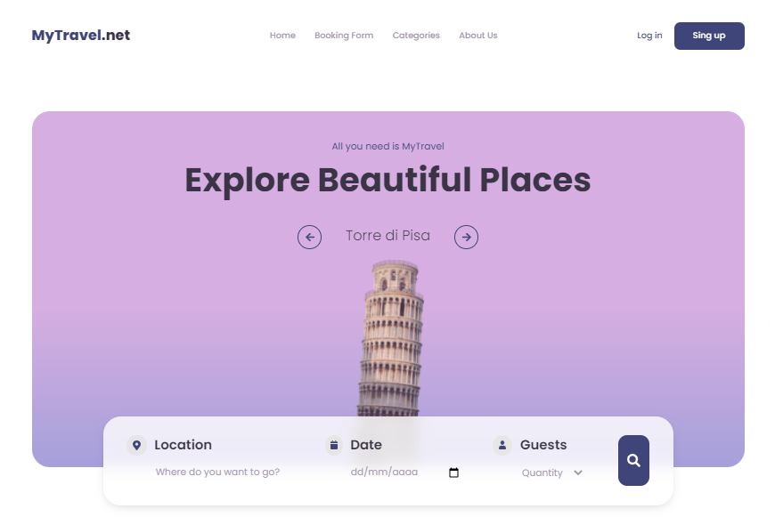
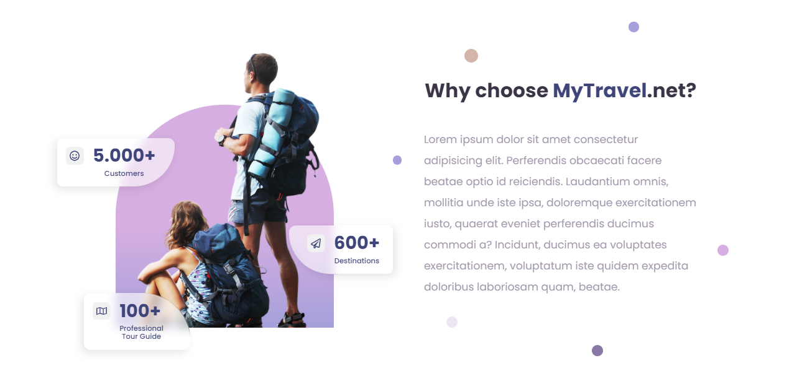

# MyTravel.net
This is a travels website homepage.

## **Demo.** 🚀
If you want to see a demo, you can give [clik here](https://kreyes96.github.io/my-travel-net/).

## **Preview.** 🧐
The project looks like this:

## **Author.** ✍️
Absolutely each of the files in this repository are my own, except for third-party code such as "Bootstrap", among others, and mainly the image of the website design, which I have mostly replicated for demonstration purposes.

[**Design**](https://dribbble.com/shots/16123098-Tour-ink-Landing-Page-Travel) taken from the [**Pickolabs**](https://dribbble.com/Pickolab) profile on Dribbble.com.